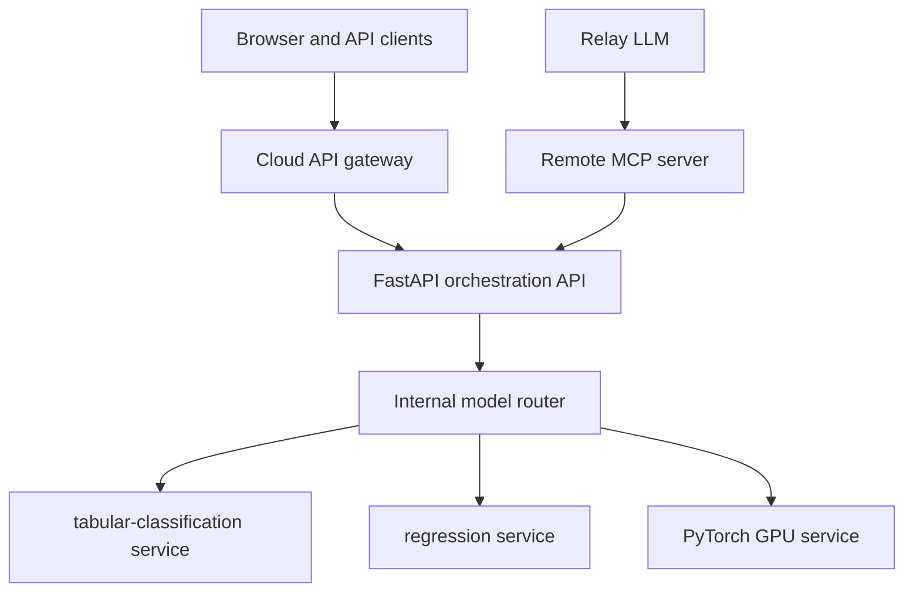

# API gateway and model microservice routing

## Decision

Use a cloud gateway at the external boundary and Kubernetes-native private service discovery inside GKE or AKS. Google Cloud API Gateway/Apigee, Azure API Management, or Kong can provide the public policy layer. MCP remains an agent tool protocol, not the request gateway.



## Public routes

Only stable business-level contracts are public:

```text
POST /api/v1/infer
POST /api/v1/tasks/{task}/compare
POST /api/v1/algorithms/{algorithm}/predict
POST /api/v1/models/{model_name}/predict
POST /api/v1/models/{model_name}/versions/{version}/predict
GET  /api/v1/models
GET  /api/v1/analyses/{analysis_id}
GET  /api/v1/analyses/{analysis_id}/events
```

The gateway applies cloud identity, quotas, request-size limits, API versioning, audit headers, CORS policy, and optional private ingress. It should not decide which ML algorithm wins.

These routes are internet-accessible according to policy. The raw runtime services remain private. A gateway may offer memorable rewrites such as `/knn` or `/logistic-regression`, while clients integrate against the canonical versioned URL.

## Internal routes

Serving pools are private ClusterIP services:

```text
POST http://tabular-classification.ml-serving.svc.cluster.local/v1/models/{name}:predict
POST http://tabular-regression.ml-serving.svc.cluster.local/v1/models/{name}:predict
POST http://pytorch-gpu.ml-serving.svc.cluster.local/v1/models/{name}:predict
```

The model catalog maps logical identities to runtime classes and service locations. A specific model artifact does not need its own load balancer.

```yaml
model_name: customer-churn-xgboost
runtime_class: tabular-cpu
service: tabular-classification
path: /v1/models/customer-churn-xgboost:predict
alias: champion
```

The serving pool resolves the alias through MLflow, validates runtime compatibility, loads the artifact into a bounded cache, and invokes its PyFunc contract.

## Logical versus physical microservices

| Unit | Addressable? | Independent deployment? |
|---|---:|---:|
| Model artifact/version | Yes | Usually no |
| Algorithm endpoint | Yes | Optional |
| Runtime serving pool | Yes | Yes |
| GPU/large model | Yes | Usually yes |

This preserves the useful microservice abstraction without creating hundreds of pods and load balancers.

## MCP path

The relay agent calls a coarse-grained MCP tool such as `compare_compatible_models`. The MCP implementation calls the orchestration core, which invokes the internal router. The relay agent should not need a separate MCP tool for every version or know Kubernetes service names.

## Failure and resilience behavior

- Per-model timeout and circuit breaker.
- Bounded parallelism per analysis.
- Partial comparisons allowed when one challenger fails.
- Champion failure never silently substitutes an incompatible task model.
- Previous champion retained as an explicit rollback target.
- Correlation IDs propagated from API Management through model results and MLflow traces.
- Retries only for safe transport failures; inference requests receive idempotency keys.
