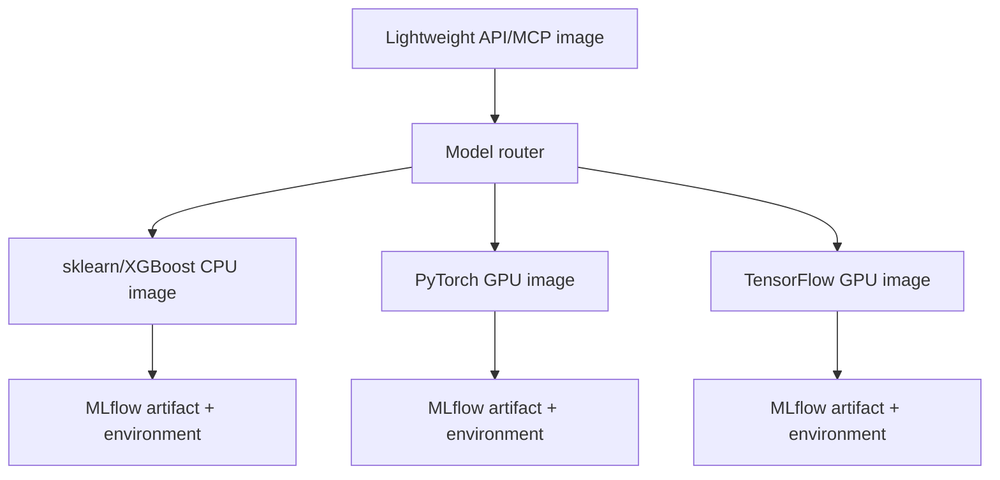

# MLflow dependency and endpoint design

## Principle

Push inference dependencies down to the endpoint that loads the model. Keep the relay agent, MCP server, API gateway, planner, and catalog independent of model frameworks.



## Two reproducibility layers

1. **Artifact environment:** MLflow logs the model flavor, inferred signature, pip/Conda environment, code paths, and optional extra requirements. This is the precise reproducibility contract for a model version.
2. **Serving-pool image:** A tested container supplies the compatible runtime family, OS libraries, security patches, health endpoints, cache, and observability agent.

The container should not dynamically install arbitrary packages on every prediction. Build and scan immutable images in CI, then validate an MLflow artifact against its compatible pool before promotion.

## Runtime classes

| Runtime class | Installed at endpoint | Typical models |
|---|---|---|
| `tabular-cpu` | MLflow, pandas, scikit-learn, XGBoost | Logistic, KNN, Naive Bayes, forests, boosted trees |
| `pytorch-gpu` | MLflow, PyTorch, CUDA-compatible base | MLP, CNN, transformer classifiers |
| `tensorflow-gpu` | MLflow, TensorFlow, compatible CUDA stack | Keras/TensorFlow networks |
| `forecast-cpu` | MLflow, statsmodels, forecasting packages | ARIMA, ETS, classical forecasting |
| `llm-vllm-gpu` | vLLM and matching CUDA stack | Generative transformer models |

The model catalog stores `runtime_class`. Routing fails closed if the artifact requests a runtime not supported by the target pool.

## Artifact loader behavior

At startup or first use, a serving pool:

1. resolves `models:/name@alias` through MLflow;
2. reads the model metadata and signature;
3. validates the declared runtime class;
4. loads and caches the artifact;
5. validates request input against the signature;
6. returns a normalized result contract.

Alias resolution should be refreshed on a controlled interval or registry event. Exact versions remain immutable, and the previous champion stays warm during canary rollout for immediate rollback.

## CI/CD gates

```text
train candidate
→ log MLflow environment and signature
→ build/select runtime image
→ offline dependency validation
→ vulnerability and license scan
→ ephemeral endpoint smoke test
→ register challenger
→ shadow/canary
→ promote alias
```

Framework dependency changes create a new model artifact and usually a new serving image tag. They never mutate a running champion container in place.

