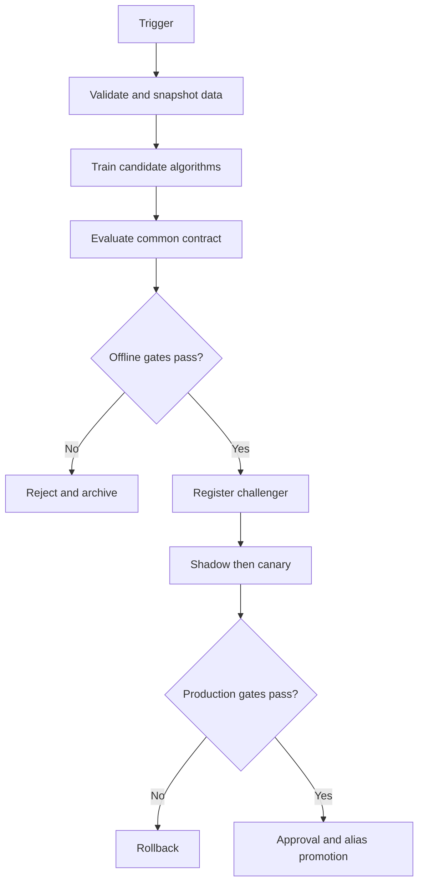

# Model lifecycle and CI/CD

## Identity hierarchy

```text
task / algorithm / framework / schema / artifact-version / deployment-role
```

Examples:

```text
customer-churn / logistic-regression / sklearn / features-v4 / 18 / champion
customer-churn / xgboost / xgboost / features-v4 / 22 / challenger
customer-churn / mlp / pytorch / features-v4 / 8 / canary
```

## Operational roles

| Role | Function |
|---|---|
| Champion | Current production default |
| Challenger | Best offline candidate awaiting production evidence |
| Canary | Candidate receiving limited live traffic |
| Previous champion | Fast rollback target |
| Experimental | Optional research candidate, never automatically routed |

MLflow aliases represent mutable roles. Exact version URIs represent immutable artifacts. A separate task-routing record identifies the task-level default across algorithm families.

## Continuous-training triggers

Training is controlled and event-driven, not an unbounded loop:

- schedule reached;
- minimum labeled-row threshold reached;
- data drift crossed;
- performance degradation crossed;
- feature pipeline changed;
- dependency/security rebuild required;
- approved experiment requested.

## Promotion gates

A candidate must pass all mandatory gates:

```yaml
quality:
  minimum_relative_improvement: 0.03
  segment_regression_tolerance: 0.01
operations:
  maximum_p95_latency_ms: 100
  maximum_error_rate: 0.005
governance:
  schema_valid: true
  lineage_complete: true
  vulnerability_gate_passed: true
  human_approval_required: true
```

The comparison differs by level:

- Within-algorithm: XGBoost v21 versus XGBoost v22.
- Across-algorithm: best XGBoost versus best random forest versus best neural network.

## Pipeline stages



## Retention

Keep only the small operational set loaded. Preserve historical run metadata and artifacts in lower-cost storage according to audit and rollback policy. Version-count limits should apply to loaded/deployable artifacts, not destroy reproducibility.

